# 调度

当有任务需要处理，但是由于CPU资源有限，这些任务没法同时处理，这就需要某些规则来决定这些任务的处理顺序，这就是调度。

调度：选择一个进程 + 进程切换
+ 选择一个进程：对应的是调度算法
+ 进程切换的过程类似函数调用，主要是完成以下两部分：
  + 对原来的运行进程保存现场
  + 对新的进程恢复数据

## 调度层次
调度的三层次：高级调度、中级调度和低级调度
### 高级调度

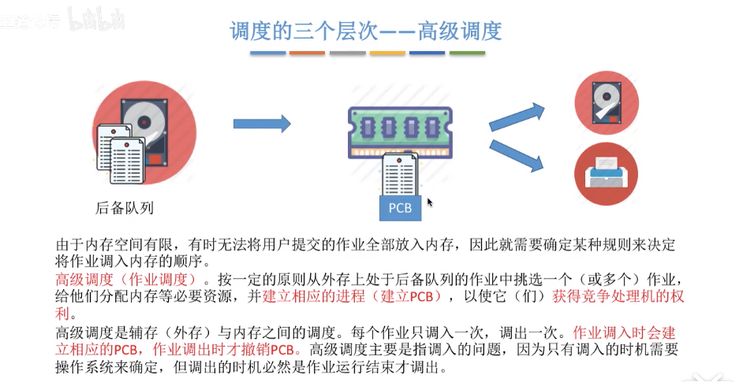  

高级调度，又叫作业调度，是将处于内存外的后备队列中的作业调入内存，给 **他们分配内存等必要资源，并且建立相应的进程，建立PCB**。高级调度是外村和内存之间的调度， 只执行一次：调入一次，调出一次，在调入时建立相应的PCB，作业调出时才撤销PCB，大致对应一个程序的运行和结束。

高级调度主要是调入问题，只有在调入的时候才操作系统来确定，而调出是顺其自然的。

### 中级调度

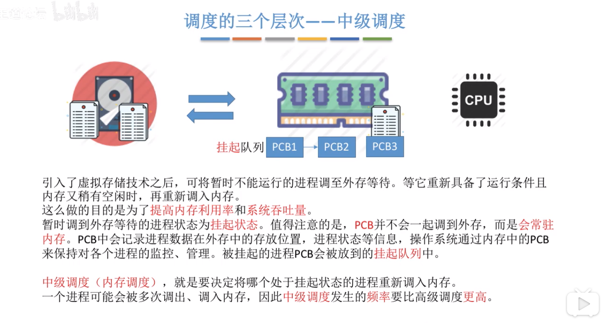

在中级调度中，可以将暂时不运行的的进程调到外存变为挂起状态放到挂起队列中，等这个进程变成就绪状态且内存又空闲时，再重新载入内存。在调出的过程，该进程的PCB控制块不会一起调至外村，而是常驻内存。

中级调度，又叫内存调度，就是决定将哪个处于挂起状态的进程重新载入内存。一个进程可能会多次被调出、调入内存，因此中级调度的频率高于高级调度。
### 低级调度

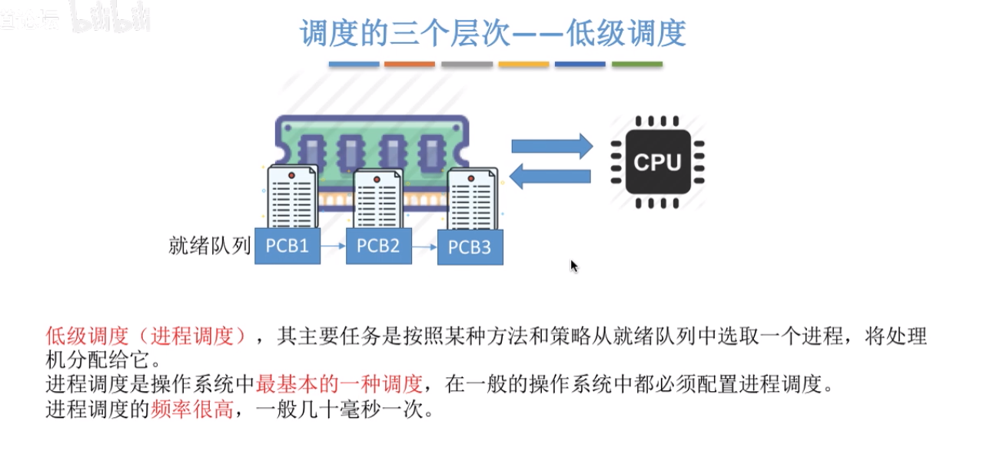 

低级调度，其实就是后面即将介绍的**进程调度**，其任务是从就绪队列中选取一个进程，获取CPU资源。

进程调度是操作系统中最基本的一种调度，其频率最高。

### 三个调度层次总结

   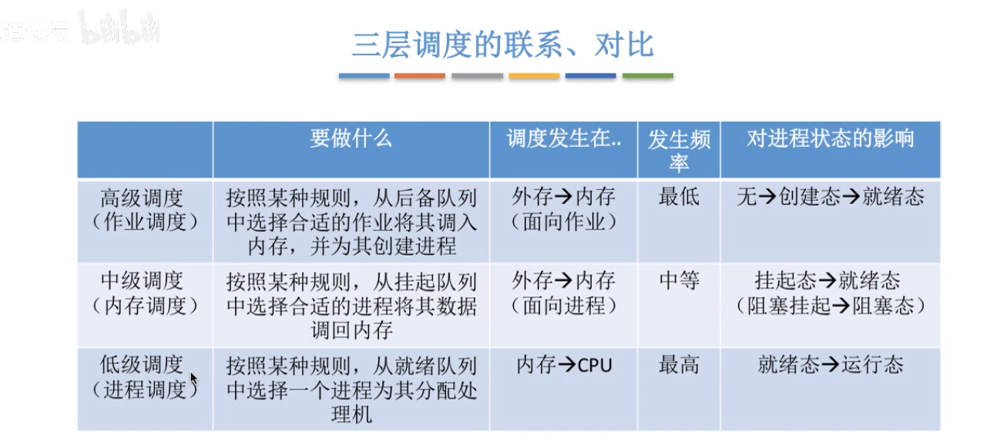

#### 挂起状态
在中级调度中的挂起状态：暂时调到外存等待的进程状态，(`suspend`)。可以分为：就绪挂起、阻塞挂起两种。

进程的五种状态模型和挂起状态 

  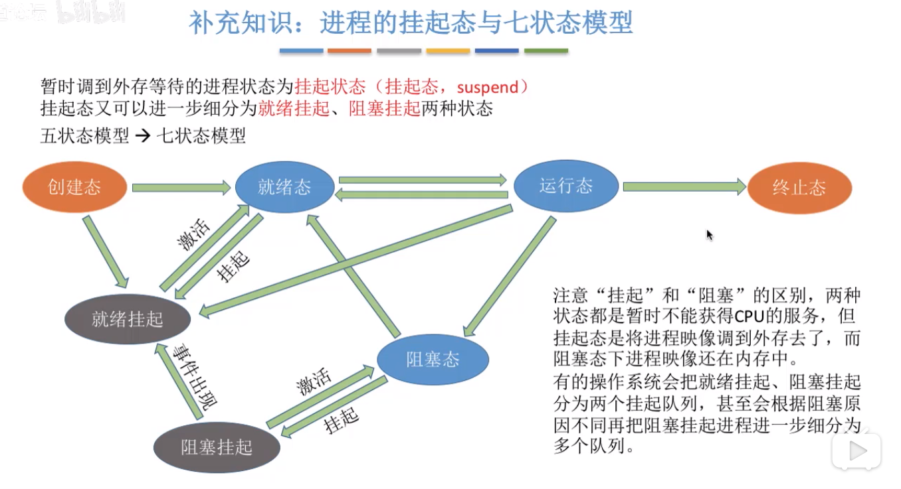

+ 就绪挂起：可以从创建态、就绪态、运行态和阻塞挂起转换为就绪挂起。等操作系统使用中级调度将其载入内存变为就绪态，等待CPU资源的分配。
+ 阻塞挂起：只能从阻塞态转换为此。将处于阻塞态的进程调出内存，等待事件出现变为就绪挂起。

## 进程调度时机 
进程调度，即低级调度，即从就绪队列中选择一个进程分配CPU资源。

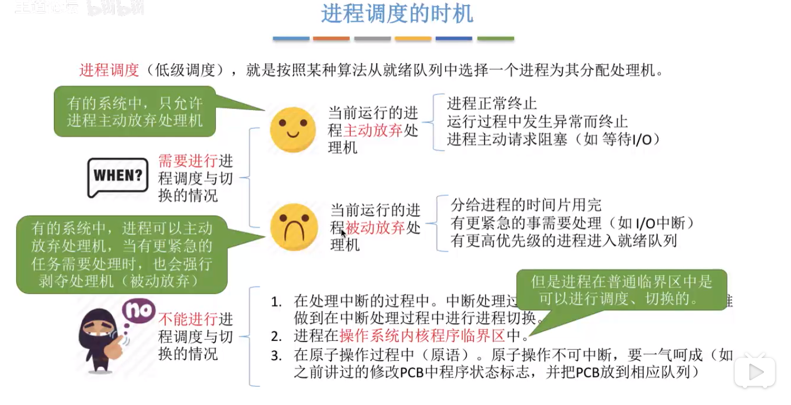 

有的场景不能调度，在能调度时候，又可以细分为进程主动放弃CPU和被动放弃CPU  
+ 需要进行调度时机
  + 当前处于运行态的进程**主动**放弃CPU
    + 进程正常终止
    + 异常终止
    + 进程主动请求资源而被堵塞（比如I/O响应）
  + 当前运行的进程**被动**放弃CPU
    + 分给进程的时间片用完
    + 有更紧急的事需要处理（比如中断）
    + 有更高优先级的进程进入就绪队列
+ 不能进程调度的时机  
  下面三个状态下的进程，只能等进程运行结束，系统才可以进行调度。
  + 在处理中断的过程中
  + 进程处于操作系统内核临界区中
  + 在原子操作过程中

## 调度算法的评价指标
### 周转时间
作业完成时间，是指作业被提交给系统开始，到作业完成为止的这段时间间隔。组成部分：
+ 作业从**外存后备队列上**等待作业调度的时间(高级调度)
+ 进程在**就绪队列上**等待程序调度的时间（低调调度时间）
+ 进程在CPU上的执行时间（真正的执行时机）
+ 进程在等待I/O操作完成的时间

其中，后面三项可能会发生多次。

而周转时间 = 作业完成时间 - 作业提交时间。 平均周转时间 = 各个作业周转时间之和 / 作业数。但是平均周转时间并不能很好的衡量每个作业的周转时间。

#### 带权周转时间：  

 

此时，对于周转时机相同的两个作业，实际运行时间越长，其带权周转时间越小，在相同的时间内被服务的时间更多。而对于实际运行时间相同的两个作业，周转时间越小的带权周转时间小，能被服务的次数也叫越多。

带权周转时间越小，用户满意度越高。越大，体验越差，说明真正的运行时间比其周转时间小很多，大部分时间都不是花在了运行上。

### 等待时间 
等待时间，是作业/进程等待被处理之前的时间。等待时间越长，其满意度越差。调度算法其实本质上就是改变等待时间，不按照原来的等待时间来服务。
+ 进程而言，等待时间是指进程建立后等待被服务的时间之和。在等待I/O完成的期间其实也是在被服务的，这段时间不计算为等待时间。
+ 作业而言，因为作业还没变成进程，因此除了进程的等待时间，还要加上在外存的后备队列中的等待时间。

调度算法只会影响作业/进程的等待时间，因为作业的被CPU服务多久，被I/O设备服务多久都是固定的。
### 响应时间
从用户提交请求到首次产生响应的时间

## 调度算法

### 先来先服务 `First Come First Serve`

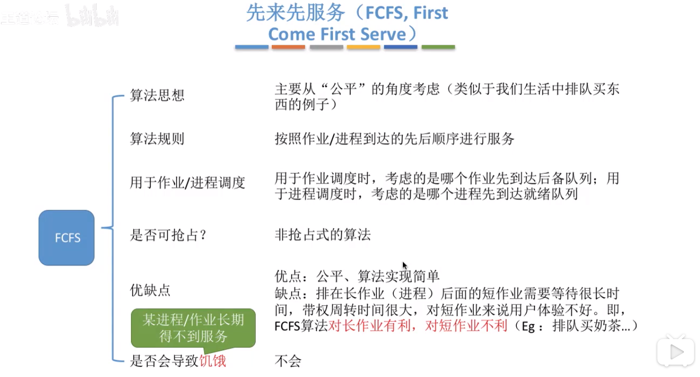

即先到来的先获取CPU资源，直到这个进程主动放弃CPU资源才会轮到下一个进程，而下一个进程就是就绪队列中的最先到来的。很明显这是一个非抢占式的调度算法，每个进程都能被运行，但是当长作业占据CPU时间很长的时候，那么导致后面的短作业等待很长时间。

### 短作业优先 `Short Job First`

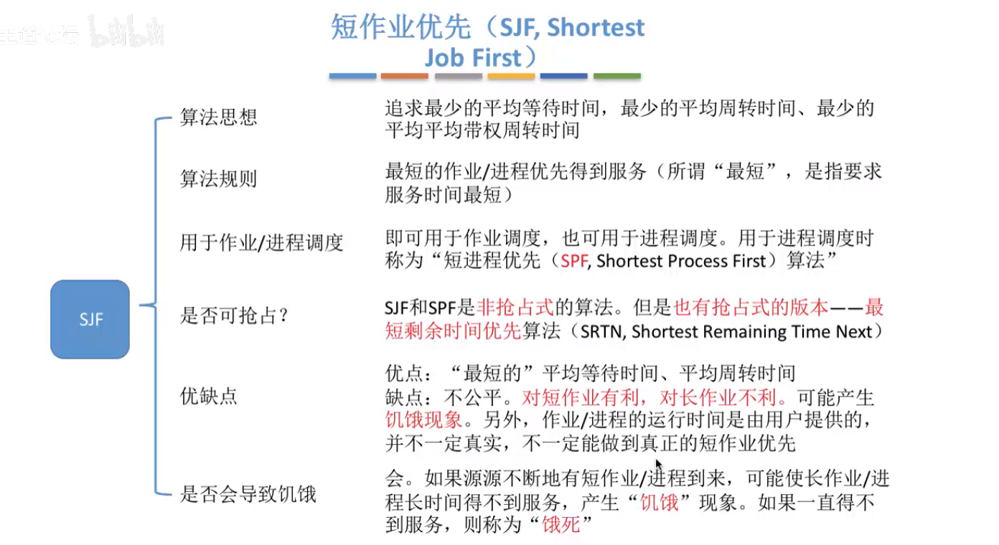 

其原则就是，实际运行时间最短的进程/作业优先被服务。细分为抢占式和非抢占式，抢占式也可以叫做最短剩余时间优先算法。

#### 非抢占式
比如，下面的简单案例，使用非抢占式的短作业优先算法，进程运行次序：

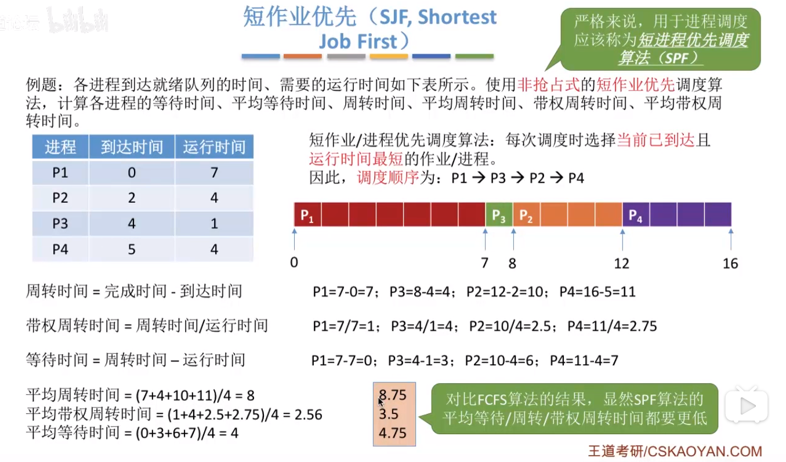 

它每次都是从就绪队列中，选择运行时间最短的进程。每次发送调度，都是发生在当前运行进程主动放弃CPU资源时。

#### 抢占式

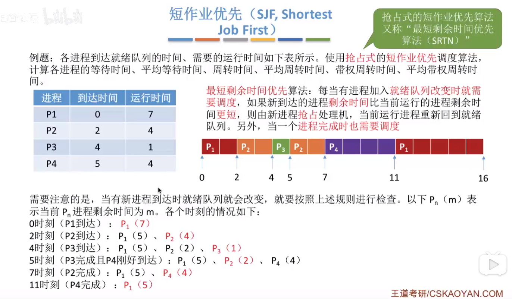 

发生调度的时间：
+ 当前运行的进程主动放弃CPU资源，比如运行结束
+ 当有新的进程加入就绪队列，其运行时间比当前运行的进程运行剩余时间短

  抢占式运行指标如下图，可见更低： 

  

#### 思考
先来先服务算法是选择等待时间最长（就绪队列中最先到来的等待时机最长）的为其服务，但是没有考虑到作业的运行时间，因此导致对短作业的不友好问题。短作业优先算法，是选择一个执行时间最短的作业，但是不考虑各个作业的等待时间，因此对长作业不友好，甚至造成饥饿甚至饿死的问题。

### 高响应比算法
高响应比优先算法，综合考虑了作业/进程的等待时间与需要被服务的时间。

每次当前运行态的进程主动放弃CPU时，都会计算出响应比最高的进程，将为其设置为运行态。因此优先被服务的队列，其响应比最高，响应比= (等待时间 + 要求被服务时间) / 要求被服务时间。 因此响应比肯定是大于1。

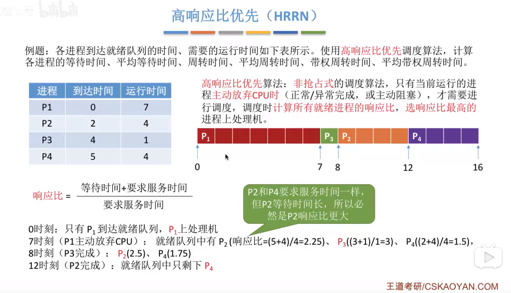 

在高响应比优先策略下，综合考虑了等待时间和运行时间。等待时间相同的，服务时间最短的优先。服务时间相同的情况下，等待时间越长的约优先。因此一个运行时间很长的任务，随着其等待时间增长其优先级也会越来越高，

### 三种调度算法总结

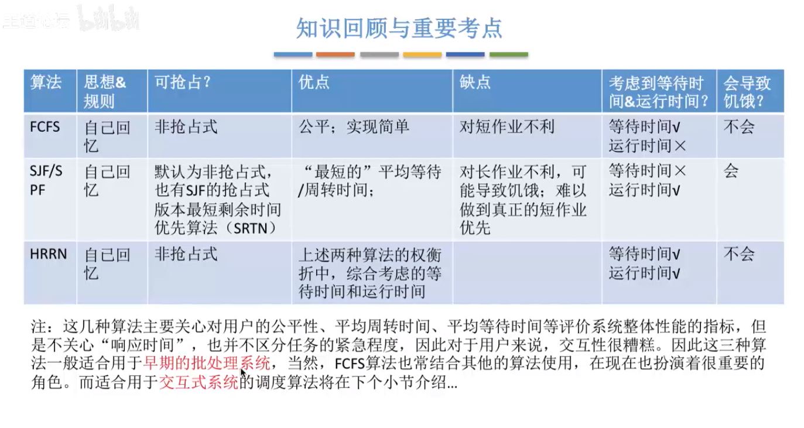 

## 交互调度算法

### 时间片轮转
设定一个时间片，这个时间片是每个任务被服务的时间。而对每个进程的选择，直接按照就绪队列中进程的属性。如果在指定的时间片内任务没有运行完，那么就剥夺这个任务的CPU资源将其放入就绪队列的队尾。因此这个算法是抢占式的，且每个队列都能运行到，不会导致饥饿。

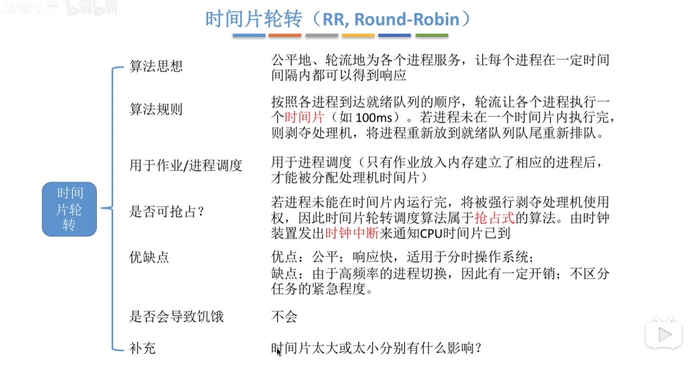 

当时间为2个单位时，示例如下， 

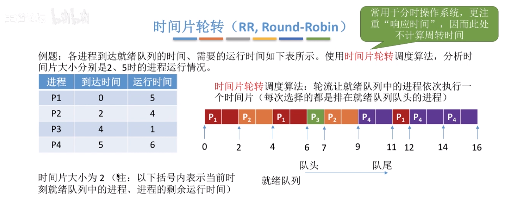 
 
 
 

但是当时间片设置过大，会退化为先来先服务调度算法。 

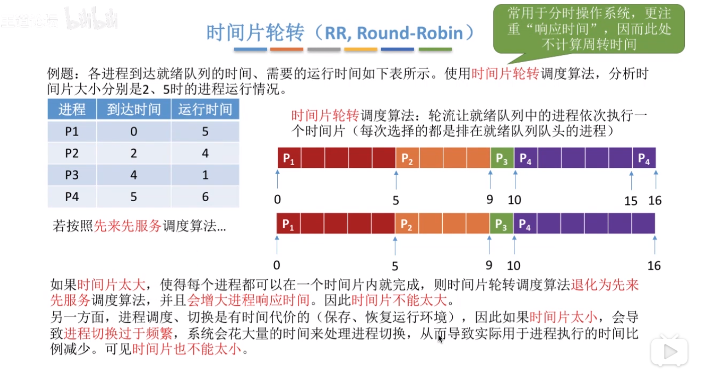 

### 优先级调度算法
根据不同的优先级来选择不同的进程，先来先服务，短作业优先和高响应比优先都是优先级调度算法，优先级调度算法先建立一个优先级，然后根据这个优先级来调度进程。

优点是，自定义优先级区分紧急程度、重要程度。可以灵活的调整对不同作业/进程的偏好程度。这类进程的缺点是： **如果有源源不断地高优先级进程到来，则可能导致某些低优先级进程饥饿，甚至饿死。**

#### 动态优先级
在创建进程时有一个初始化值，之后根据情况动态的调整优先级。 

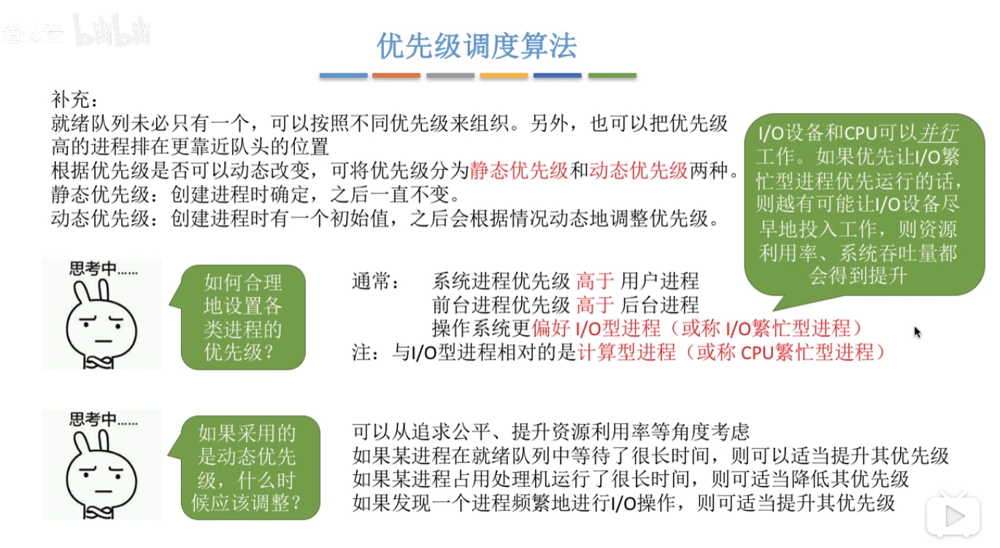 

### 多级反馈队列算法
怎么综合`FCFS`的公平，`SJF`尽可能快处理短作业的优点、时间轮片算法可以让各个进程都得到及时响应的优点以及优先级调度算法的可以灵活地地调整各个进程被服务的机会的优点。因此有了多级反馈队列算法。

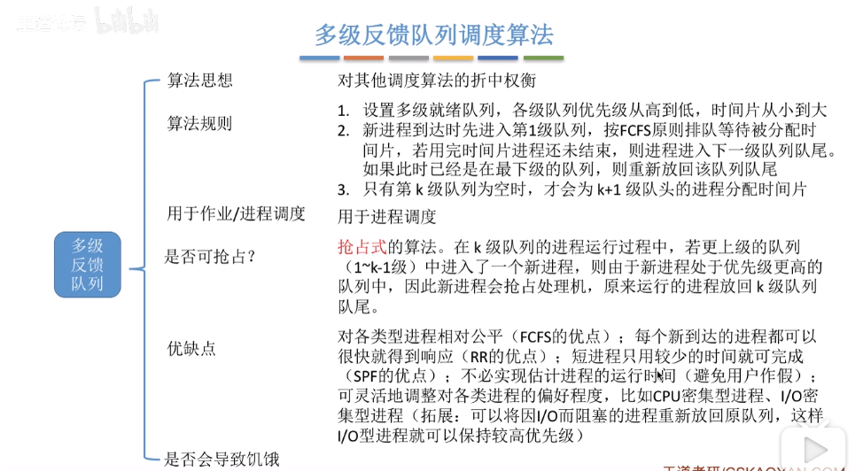 

这个算法就是设计多个就绪队列，各级队列优先级从高到低排列，时间片从小到大。
+ 新进程先进入第一级队列按照`FCFS`原则等待被分配时间片。
+ 如果用完时间片这个进程还没进程，就将这个进程放到下一级就绪队列尾部，如果当前就是最后一级队列，那么下一级就是回到了第一级就绪队列的队尾。确保了，没有执行完的任务还能再次被服务。
+ 只有第k级的就绪队列为空时，才会为k+1就绪队列分配时间片，确保了优先级高的先被服务，即新进来的任务。如果有源源不断的新的任务到来，那么下一级的就绪队列中的任务是可能造成饥饿的。

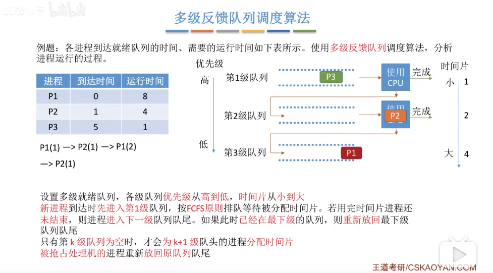

#### 三个调度总结 
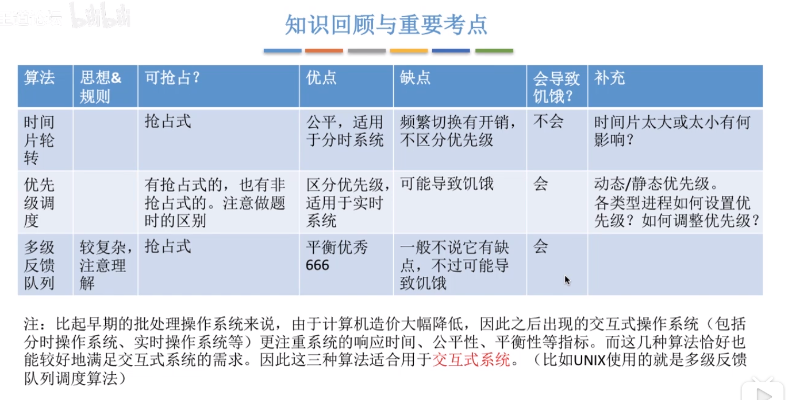